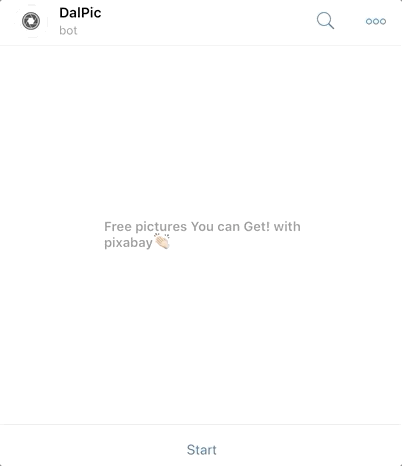

## Project title
**DalPic_bot** Telegram bot Node.js Server

## TelegramBot
ID : __@Dalpic_bot__ 
Link : [t.me/DalPic_bot](https://t.me/DalPic_bot)

## Demo

## Tech/framework used
 - node-telegram-bot-api
 - express
 - request

<b>Built with</b>
- [Webstorm](https://www.jetbrains.com/webstorm/)
- [Heroku](https://www.heroku.com/)

## Code Example
~~~
bot.onText(/\/start/, (msg, match) => {
    const chatId = msg.chat.id;
    text = "Hi! This is Example!";
    bot.sendMessage(chatId, text);
});
~~~

## Installation
~~~
npm install
node app.js
~~~

## Caution
~~~
const token = YOUR_TOKEN; //This is Telegram Token
const API_KEY =YOUR_API_KEY; //This is Pixabay API_KEY
~~~

## Tutorial
[dalhav.github.io](https://dalhav.github.io/2019/06/06/DalPicbot/)

## License
[MIT License](LICENSE)

## MADE
© [Dalhav]
